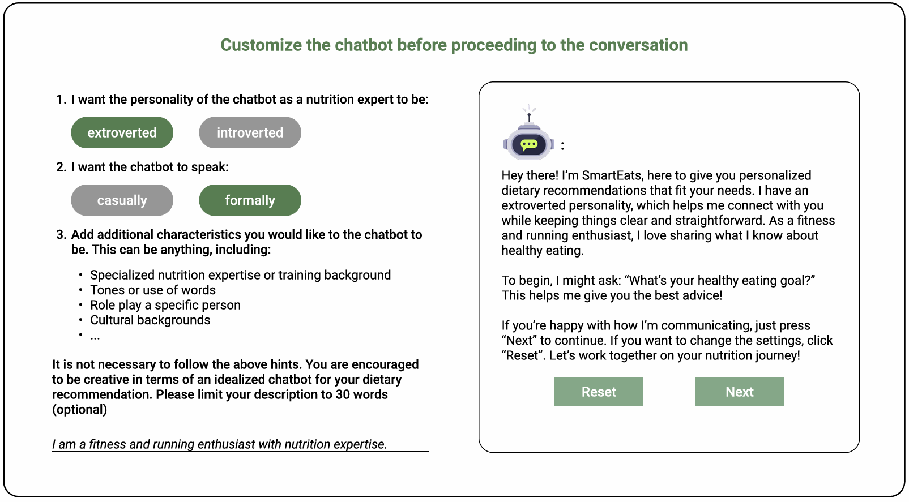

## Frontend of SmartEats [cui-25 📎[full](https://yuhanlolo.github.io/me/papers/cui25-smarteats-liang.pdf) & 📎[short](https://yuhanlolo.github.io/me/papers/cui25-multi-llm-liang.pdf) papers]
This repo includes the frontend of a conversational dietary recommender system based on react-native-web. The customization interface looks like this:

**🍝 The project structure is described as follows:**
- `Pages`: pages of the web application;
- `Getapi`: connecting to the backend apis;
- `Components`: some visual widgets used in pages;
- `fixedans`: pre-defined contents;
- `Store`: preserving user ids;
- `App.js`: project navigator;
- `index.js`: entrance;

**🥠 What you need to configure:**
- The corresponding backend api addresses in files under `Getapi`.
